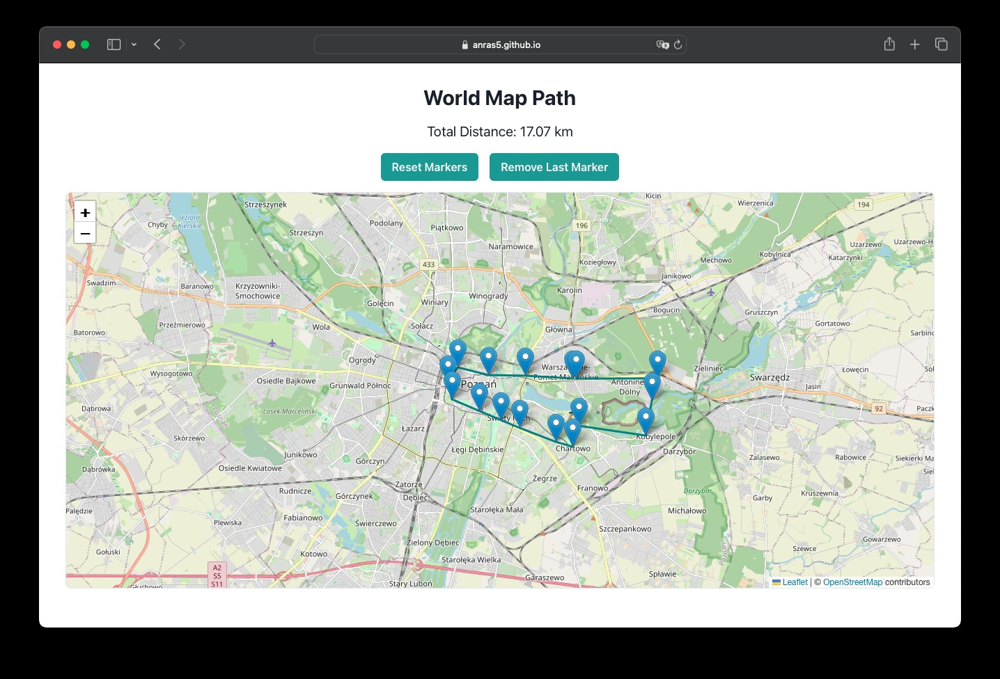

# World Map Path

World Map Path is a simple application that allows you to create, save, and manage paths on a world map. You can mark locations, calculate distances, and share paths with others.

The app is available on [GitHub Pages](https://anras5.github.io/world-map-path/).



## How to Use

### Creating Paths
- Click anywhere on the map to add a marker to your path
- Use the GPS button to add your current location as a marker
- The total distance of your path is displayed at the top of the page
- Use Reset Markers to clear all markers
- Use Remove Last Marker to delete the most recently added marker

### Saving & Loading Paths
- Click Save path to store your current path with a unique name
- Click Load path to view, load, or delete previously saved paths
- In the load dialog, you can copy paths to clipboard for sharing
- You can also import paths from clipboard that others have shared with you

### Keyboard Shortcuts
- Ctrl + Z (or ⌘ + Z on Mac): Remove last marker
- Ctrl + S (or ⌘ + S on Mac): Open save path dialog

## Development

To run the project locally:

```bash
npm install
npm run dev
```

To build the project:

```bash
npm run build
```
